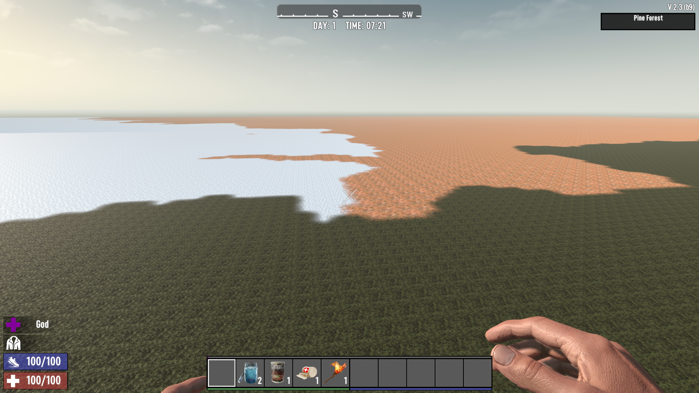

# ISI Flat

## Overview

ISI Flat is a simple yet effective mod for 7 Days to Die that modifies the world generation to create completely flat maps. This mod is perfect for players who want a clean, flat canvas for building or for creating custom maps with a consistent terrain base.

## Features

- Completely flat terrain generation
- Removes all terrain variations including hills, mountains, and water features
- Disables decorative elements for a clean slate

## Screenshots

In-game view of the flat terrain

Overview of the flat terrain generation

Zoomed-in view showing the flat terrain generation

Aerial view showing the completely flat terrain

## Configuration

This mod works by modifying the following game files:

- `biomes.xml`: Removes all decorations and terrain features
- `rwgmixer.xml`: Disables terrain variations and features like mountains, lakes, and rivers

## Installation

1. Ensure you have a clean installation of 7 Days to Die
2. Copy the `ISI_Flat` folder into your `7 Days To Die/Mods/` directory
3. Start the game and generate a new world

## License

This mod is provided as-is. Feel free to use it in your own projects, but please credit the original author.

## Testing

1. Generate a new world with the mod enabled
2. Verify terrain is completely flat across all biomes
3. Check that no hills, mountains, or water features are present
4. Confirm decorative elements (trees, rocks, bushes) are disabled

**Important**: This mod is incompatible with ISI_WorldGenTweaker. Test them separately to avoid conflicts.
